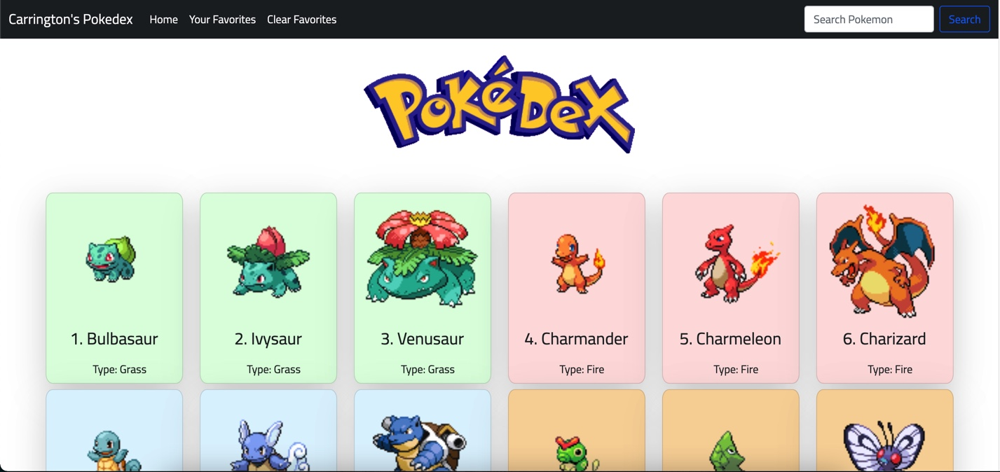

# Pokedex

- Pokedex application using PokeAPI. Users can search for their favorite Pokemon and even favorite multiple Pokemon.
- Technologies used: HTML, CSS, Bootstrap, Javascript(ES6), jQuery.
- Source: [PokeAPI] (https://pokeapi.co/)
- Page: [Pokedex] (https://dev1.d2aq2jzg5h89fj.amplifyapp.com)

